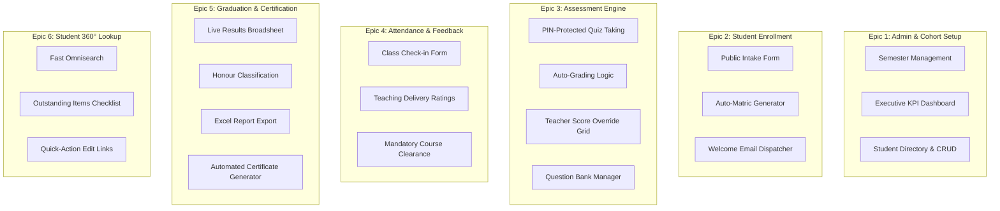
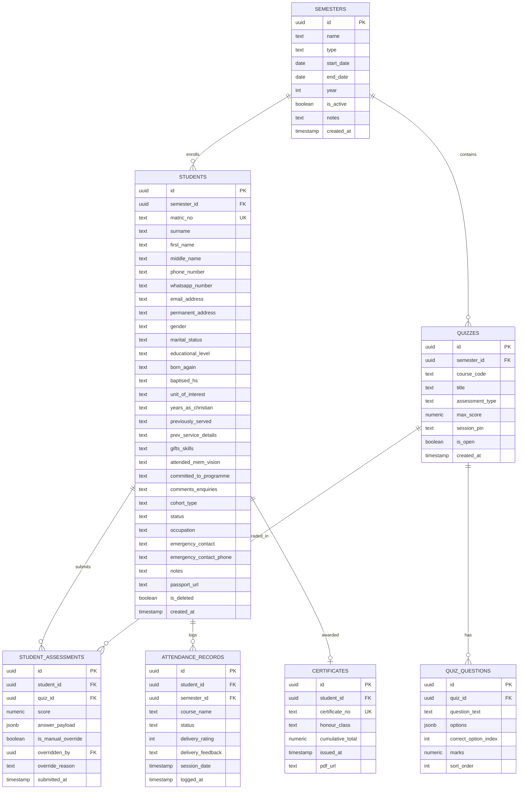
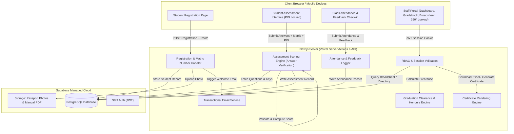

# PROJECT BLUEPRINT: Citizens Elementary School (CES) Web Platform

## 0. Project Profile

| Attribute | Value |
| :--- | :--- |
| **Project Name** | CES Portal (Citizens Elementary School Discipleship Training Platform) |
| **Project Type** | Client Project / Internal Organisation Tool |
| **Owner / Client** | Citizens of Light Church / Citizens Elementary School (CES), Ilorin, Nigeria |
| **Platform** | Responsive Web Application (Mobile-first for assessments; Desktop-first for administration) |
| **Public Pages** | Yes (Student Registration Form, Student Assessment Access, Class Attendance & Feedback) |
| **Users & Scale** | Launch: ~50–120 students/cohort; 12-Month Projection: ~300–600 students across 3–4 cohorts; Peak Concurrency: ~100 simultaneous quiz takers |
| **User Locations & Legal**| Ilorin, Nigeria; Governed by the **Nigeria Data Protection Act (NDPA 2023)** |
| **Languages** | English (en-US / en-GB) |
| **Data Sensitivity** | Medium/High (Full contact info, home addresses, spiritual background, passport photos, academic records) |
| **Payments** | N/A (Zero payment processing in Version 1) |
| **AI Features** | N/A (Deterministic assessment and score calculation; no generative AI) |
| **Primary Stack** | **Next.js 14/15 (App Router, TypeScript, Tailwind CSS)**, **PostgreSQL / Supabase** (Database, Auth, Storage) |
| **Key Integrations** | Transactional Email (Nodemailer with CES Gmail App Password or Brevo API), Supabase Storage (Passport photos & manuals) |
| **Hosting & Deploy** | **Vercel** (Frontend/API) + **Supabase** (Managed DB, Auth, Object Storage) — $0/mo free hobby tier |
| **Environments** | Development (`localhost`), Production (`ces.citizensoflightchurch.org` or temporary Vercel production alias) |
| **Rigor Level** | **STRICT** (Full automated unit test suite, Playwright E2E flows, load testing for 100 concurrent test-takers, security audit) |

---

## 1. Problem and Outcomes

### Problem Statement
CES administrators and instructors manage admissions, testing, attendance, and graduation across disconnected Google Forms and complex Excel workbooks. This setup creates critical vulnerabilities:
1. **Fragile Formula Chains**: VLOOKUP formulas break easily when student names are modified or rows are sorted.
2. **Manual Scoring Overhead**: Teachers collect physical or ad-hoc quiz papers and manually enter scores, creating grading delays and transcription errors.
3. **Audit Bottlenecks**: Auditing whether a student has met all graduation criteria (cumulative total $\ge 50$ + both non-graded attendance courses marked as `Attended`) is tedious and error-prone.
4. **Onboarding Delays**: New registrants do not receive immediate admission documentation or class manuals.

### Measurable Success Criteria
- **Zero Calculation Discrepancies**: 100% mathematical parity with the verified PRD scoring and graduation logic.
- **Zero Registration Delay**: Admission number generated and welcome email dispatched in $< 5\text{ seconds}$ post-registration.
- **Instant Grade Capture**: Student quiz/exam scores posted to their profile immediately upon submission with zero manual teacher transcription.
- **Auditing Velocity**: Graduation broadsheet and student audit profile generated in $< 1\text{ second}$.
- **Concurrent Reliability**: System handles 100 simultaneous quiz submissions without dropping responses or exceeding 1.5s p95 latency.

### User Stories & Acceptance Criteria

#### US-01: Student Registration & Auto-Matriculation
- **As an** Enrolling Student (or Admin enrolling on their behalf),
- **I want to** submit my personal details, contact information, spiritual background, and passport photograph via an online form,
- **So that** I am registered into the active cohort, assigned an official matriculation number, and receive my course manual immediately.
- **Acceptance Criteria**:
  - Validates all 28 required fields and image upload (JPEG/PNG $< 2\text{MB}$).
  - Automatically generates matric number: `CES/ILR/YY[MonthLetter][MonthDigit][Sequence]` (e.g. `CES/ILR/26H801`).
  - Dispatches an automated welcome email with cohort details and course manual download link.
  - Returns confirmation screen showing generated matric number and onboarding instructions.

#### US-02: Online Student Assessment with PIN Access
- **As an** Enrolled Student,
- **I want to** take my course quiz (8 modular courses, max 5 marks) or final exam (max 60 marks) on my smartphone using my Matric Number and the in-class Teacher PIN,
- **So that** my test is automatically graded and recorded directly to my academic profile.
- **Acceptance Criteria**:
  - Validates student matric number and verifies student belongs to the active cohort.
  - Requires active Session PIN provided by the teacher for that specific course quiz.
  - Prevents duplicate submissions (student can only submit once per quiz unless admin resets).
  - Displays questions with radio options, auto-saves draft answers in local storage in case of network drops.
  - Computes score immediately upon submission and writes to `student_assessments`.

#### US-03: Class Attendance & Delivery Feedback
- **As a** Student / Class Attendee,
- **I want to** check in at the end of class and submit feedback on the quality of teaching delivery,
- **So that** my attendance is logged for graduation clearance and church leadership receives delivery ratings.
- **Acceptance Criteria**:
  - Captures matric number, session date, and course.
  - Includes a 5-star delivery quality rating and optional text comments.
  - Automatically marks `Attended` for the student in that course.

#### US-04: Teacher Gradebook & Emergency Score Override
- **As a** CES Teacher,
- **I want to** view real-time score rosters, monitor quiz completions, and manually override or enter scores for students with device failures,
- **So that** grading proceeds smoothly regardless of student phone or network issues.
- **Acceptance Criteria**:
  - Scores entered manually are capped strictly (quizzes $\le 5$, exam $\le 60$).
  - Logs manual score edits with teacher ID and timestamp for audit purposes.
  - Recalculates student cumulative total instantly.

#### US-05: Executive Graduation Clearance & Certificate Generation
- **As a** Super Administrator / Director,
- **I want to** view the live semester results broadsheet, filter by graduation status, export to Excel, and generate graduation certificates,
- **So that** only qualified students are cleared and certified without manual calculation errors.
- **Acceptance Criteria**:
  - Enforces graduation rule: Total $\ge 50$ AND Elementary Principles = `Attended` AND Membership & Vision = `Attended`.
  - Enforces honour classes: Distinction ($\ge 85$), Merit ($\ge 75$), Pass ($\ge 50$), Below Pass ($< 50$).
  - One-click Excel broadsheet export.
  - Generates print-ready high-resolution certificates for all `✅ GRADUATE` students.

### Requirements Mapping (PRD / Client Extracts)

| REQ ID | Requirement Extract | Mapped Feature / User Story | Status |
| :--- | :--- | :--- | :--- |
| **REQ-01** | Multi-user role-based access control (Super Admin, Admin, Teacher) | Section 3: User Roles & Permissions | **MVP** |
| **REQ-02** | Executive KPI Dashboard per semester | Epic 1: Admin & Cohort Management | **MVP** |
| **REQ-03** | Admission and attendance management | Epic 1 & Epic 4 | **MVP** |
| **REQ-04** | Direct web entry / online student assessments | Epic 3: Assessment Engine & US-02 | **MVP** |
| **REQ-05** | Student interaction boundary (assessment taking & feedback only) | Epic 3 & Epic 4 | **MVP** |
| **REQ-06** | Student registration matching Google Form + photo upload | Epic 2 & US-01 | **MVP** |
| **REQ-07** | Auto-matriculation `CES/ILR/YY[MonthLetter][MonthDigit][NN]` | Epic 2 & US-01 | **MVP** |
| **REQ-08** | Automatic welcome email with instructions and course manual | Epic 2 & US-01 | **MVP** |
| **REQ-09** | Unlimited semester setup with Sunday Cohort visual distinction | Epic 1 & US-01 | **MVP** |
| **REQ-10** | Searchable, filterable student directory | Epic 1: Directory Table | **MVP** |
| **REQ-11** | Student CRUD operations with confirmation dialogs | Epic 1: Student Management | **MVP** |
| **REQ-12** | 8 Quiz courses (max 5 marks each, scores $>5$ blocked) | Epic 3: Scoring Rules | **MVP** |
| **REQ-13** | Final exam (max 60 marks, scores $>60$ blocked, pass $\ge 30$) | Epic 3: Scoring Rules | **MVP** |
| **REQ-14** | Two mandatory non-graded attendance courses | Epic 4: Attendance Rules | **MVP** |
| **REQ-15** | Post-class attendance logging with delivery feedback | Epic 4 & US-03 | **MVP** |
| **REQ-16** | Automated graduation calculation (`GRADUATE`, `NOT YET`, `PENDING`) | Epic 5 & US-05 | **MVP** |
| **REQ-17** | Automated honour classification (Distinction $\ge 85$) | Epic 5 & US-05 | **MVP** |
| **REQ-18** | Graduation results broadsheet table | Epic 5: Broadsheet View | **MVP** |
| **REQ-19** | Downloadable Excel student score report | Epic 5 & US-05 | **MVP** |
| **REQ-20** | Automated graduation certificate generation | Epic 5 & US-05 | **MVP** |
| **REQ-21** | 360° Student Lookup with live Outstanding Items checklist | Epic 6: Student 360° Diagnostic | **MVP** |
| **REQ-22** | Disambiguation list for matching student search queries | Epic 6: Student 360° Diagnostic | **MVP** |
| **REQ-23** | Quick-action navigation links from lookup to edit/grade | Epic 6: Student 360° Diagnostic | **MVP** |
| **REQ-24** | Teacher manual score override fallback | Epic 3 & US-04 | **MVP** |

### Explicitly Out of Scope for Version 1
- **Student Long-Term Self-Service Portals**: Students do not have persistent logins to browse historic transcripts across multiple years.
- **Payment & Tuition Fee Gateways**: CES discipleship program does not process commercial tuition payments through this portal.
- **Automated SMS / WhatsApp Gateway Integration**: Excluded to avoid third-party API subscription costs for the church; official communication runs through automated email and in-class announcements.
- **Multi-Tenant / Multi-Campus Architecture**: System is explicitly optimized for Citizens of Light Church, Ilorin Center (`CES/ILR`).

---

## 2. Features and Scope



### Feature Roadmap

#### MVP (Must-Have for Launch)
1. **Authentication & RBAC**: Secure email/password login for Super Admin, CES Admin, and Teachers.
2. **Cohort & Semester Management**: Setup regular/Sunday semesters; active semester toggling; visual badges.
3. **Student Registration Portal**: 28-field intake form + passport photo upload to Supabase Storage.
4. **Auto-Matriculation & Email Dispatch**: Generation on submit; automated email with course manual download.
5. **Online Assessment System**: Mobile-responsive quiz/exam interface; Matric + PIN access; instant score logging.
6. **Teacher Gradebook with Override**: Real-time roster view; in-app manual score input for emergencies.
7. **Attendance & Teaching Feedback**: Class check-in with delivery rating (1–5 stars) and text feedback.
8. **Graduation Clearance Engine**: Automated status computation (`GRADUATE`, `NOT YET`, `PENDING`) and honour class (Distinction $\ge 85$).
9. **Excel Broadsheet Export**: Downloadable spreadsheet formatted for church board review.
10. **Automated Certificate Generator**: Dynamic high-resolution certificate rendering for approved graduates.
11. **Student 360° Lookup**: Real-time search across matric/first/last name with Outstanding Items checklist.

#### Next (Post-Launch Phase 2)
- Question Bank CSV import/export.
- Anonymous aggregate teacher evaluation reports based on student delivery feedback.
- Batch print all certificates to a single merged multi-page PDF.

#### Later (Future Considerations)
- Native mobile PWA with offline quiz synchronization.
- Alumni directory and graduation archive portal.

---

## 3. Users, Roles and Permissions

### Role-Based Access Matrix

| Module / Operation | Public / Student | CES Teacher | CES Admin | Super Admin |
| :--- | :---: | :---: | :---: | :---: |
| **Submit Registration Form** | ✅ | ✅ | ✅ | ✅ |
| **Take Online Quiz / Exam (via PIN)** | ✅ | ❌ | ❌ | ❌ |
| **Submit Class Attendance & Feedback** | ✅ | ❌ | ❌ | ❌ |
| **View Executive Dashboard & KPIs** | ❌ | ❌ | ✅ (Limited) | ✅ (Full) |
| **Create / Edit / Close Semesters** | ❌ | ❌ | ✅ | ✅ |
| **View Full Student Directory** | ❌ | ✅ (Roster view) | ✅ | ✅ |
| **Edit / Delete Student Records** | ❌ | ❌ | ✅ | ✅ |
| **Manage Quiz Question Banks & PINs** | ❌ | ✅ | ✅ | ✅ |
| **Override / Manually Enter Scores** | ❌ | ✅ | ✅ | ✅ |
| **View Graduation Broadsheet** | ❌ | ✅ (Read-only) | ✅ | ✅ |
| **Export Excel Results Report** | ❌ | ❌ | ✅ | ✅ |
| **Generate & Print Certificates** | ❌ | ❌ | ✅ | ✅ |
| **Manage Staff Accounts & System Settings** | ❌ | ❌ | ❌ | ✅ |

### Account Lifecycle & Authentication
- **Staff Accounts (Super Admin, Admin, Teacher)**:
  - Created via Admin invite / invitation email or seeded directly by Super Admin.
  - Authenticated via Supabase Auth (JWT session tokens stored in secure `httpOnly` cookies).
  - Password reset via email link.
  - Accounts can be deactivated instantly by Super Admin.
- **Student Access (Assessment Mode)**:
  - **Zero Account Overhead**: Students do not create passwords or hold user accounts.
  - To access an assessment: Student provides **Matriculation Number** + **Teacher Session PIN**.
  - Server verifies:
    1. Matriculation number exists and student is `Active`.
    2. Assessment session is currently open for that specific course.
    3. Session PIN matches the teacher's active code.
    4. Student has not already submitted this assessment.

---

## 4. Data Model & Database Architecture

Database: **PostgreSQL (via Supabase)**.



### Table Definitions & Constraints

#### 1. `semesters`
- `id` (UUID, PK, default `gen_random_uuid()`)
- `name` (TEXT, NOT NULL, e.g. "Semester 1 — 2026")
- `type` (TEXT, NOT NULL, CHECK in `'Regular'`, `'Sunday Cohort'`)
- `start_date` (DATE), `end_date` (DATE), `year` (INT)
- `is_active` (BOOLEAN, default `false`)
- `notes` (TEXT)
- `created_at` (TIMESTAMPTZ, default `now()`)

#### 2. `students`
- `id` (UUID, PK, default `gen_random_uuid()`)
- `semester_id` (UUID, FK -> `semesters.id`, NOT NULL)
- `matric_no` (TEXT, UNIQUE, NOT NULL, e.g. `CES/ILR/26H801`)
- Standard 28 fields: `surname`, `first_name`, `middle_name`, `phone_number`, `whatsapp_number`, `email_address`, `permanent_address`, `gender`, `marital_status`, `educational_level`, `born_again`, `baptised_hs`, `unit_of_interest`, `years_as_christian`, `previously_served`, `prev_service_details`, `gifts_skills`, `attended_mem_vision`, `committed_to_programme`, `comments_enquiries`, `cohort_type`, `status` (CHECK in `'Active'`, `'Graduated'`, `'Deferred'`), `occupation`, `emergency_contact`, `emergency_contact_phone`, `notes`
- `passport_url` (TEXT, nullable)
- `is_deleted` (BOOLEAN, default `false` for soft deletes)
- `created_at` (TIMESTAMPTZ, default `now()`)

#### 3. `quizzes`
- `id` (UUID, PK)
- `semester_id` (UUID, FK -> `semesters.id`)
- `course_code` (TEXT, NOT NULL, e.g. `'salvation'`, `'righteousness'`, `'word_of_god'`, `'love_walk'`, `'service'`, `'spiritual_authority'`, `'holy_spirit'`, `'prayer'`, `'final_exam'`)
- `title` (TEXT, NOT NULL)
- `assessment_type` (TEXT, CHECK in `'quiz'`, `'final_exam'`)
- `max_score` (NUMERIC, NOT NULL, 5 for quizzes, 60 for exam)
- `session_pin` (TEXT, nullable, e.g. `'SALV-2026'`)
- `is_open` (BOOLEAN, default `false`)

#### 4. `quiz_questions`
- `id` (UUID, PK)
- `quiz_id` (UUID, FK -> `quizzes.id`, CASCADE)
- `question_text` (TEXT, NOT NULL)
- `options` (JSONB, NOT NULL, array of 4 option strings: `["Option A", "Option B", ...]`)
- `correct_option_index` (INT, NOT NULL, 0-3)
- `marks` (NUMERIC, NOT NULL, default 1.0)
- `sort_order` (INT, default 0)

#### 5. `student_assessments`
- `id` (UUID, PK)
- `student_id` (UUID, FK -> `students.id`)
- `quiz_id` (UUID, FK -> `quizzes.id`)
- `score` (NUMERIC, NOT NULL, CHECK $\ge 0$)
- `answer_payload` (JSONB, student selected option indices)
- `is_manual_override` (BOOLEAN, default `false`)
- `overridden_by` (UUID, FK -> `profiles.id`, nullable)
- `override_reason` (TEXT, nullable)
- `submitted_at` (TIMESTAMPTZ, default `now()`)
- **Constraint**: UNIQUE (`student_id`, `quiz_id`) — prevents duplicate submissions.

#### 6. `attendance_records`
- `id` (UUID, PK)
- `student_id` (UUID, FK -> `students.id`)
- `semester_id` (UUID, FK -> `semesters.id`)
- `course_name` (TEXT, NOT NULL, e.g. `'Elementary Principles'`, `'Membership & Vision Class'`)
- `status` (TEXT, NOT NULL, CHECK in `'Attended'`, `'Not Attended'`, `'Excused'`)
- `delivery_rating` (INT, CHECK between 1 and 5, nullable)
- `delivery_feedback` (TEXT, nullable)
- `session_date` (DATE, default `CURRENT_DATE`)
- `logged_at` (TIMESTAMPTZ, default `now()`)

#### 7. `certificates`
- `id` (UUID, PK)
- `student_id` (UUID, FK -> `students.id`, UNIQUE)
- `certificate_no` (TEXT, UNIQUE, e.g. `CERT-CES-26H801`)
- `honour_class` (TEXT, NOT NULL)
- `cumulative_total` (NUMERIC, NOT NULL)
- `issued_at` (TIMESTAMPTZ, default `now()`)

### Row Level Security (RLS) Policies
- **`students`**:
  - `SELECT`: Authenticated staff (Super Admin, Admin, Teacher) can view all. Public/Anonymized can view ONLY matching row during assessment login via secure RPC.
  - `INSERT`: Public can insert new student (Registration).
  - `UPDATE`, `DELETE`: Authenticated Admin/Super Admin only.
- **`quiz_questions`**:
  - `SELECT`: Teacher/Admin can view questions and correct answers. Students retrieve questions via a secured Server Action that **strips out `correct_option_index`** before delivering to client.
- **`student_assessments`**:
  - `INSERT`: Handled exclusively via server-side Server Action after validating student identity and PIN.
  - `SELECT`: Authenticated staff only.

---

## 5. Tech Stack & Infrastructure

### Stack Architecture Comparison

| Component | Selected Option | Alternative Considered | Rationale |
| :--- | :--- | :--- | :--- |
| **Framework** | **Next.js 14/15 (App Router, TypeScript)** | Vite + React SPA + Express | Next.js combines client UI, Server Components (zero secret leakage), and Server Actions in one codebase; seamless Vercel deployment. |
| **Styling** | **Tailwind CSS + Vanilla CSS tokens** | Pure Vanilla CSS | Fast, consistent utility design system with rich dark mode/cards, excellent mobile responsiveness, and zero runtime CSS overhead. |
| **Database & Auth** | **Supabase (PostgreSQL 15)** | Self-hosted PostgreSQL on VPS | Free tier includes 500MB DB, built-in Auth, Row-Level Security, and Storage for passport photos. Zero server maintenance. |
| **Object Storage** | **Supabase Storage** | AWS S3 / Cloudinary | Built into Supabase, 1GB free storage, instant signed URLs for passport photos and PDF manuals. |
| **Email Service** | **Nodemailer (CES Gmail App Password) or Brevo API** | Resend (requires DNS verification) | Avoids requiring church domain DNS CNAME/TXT edits. Dedicated Gmail App Password or Brevo single sender allows instant sending. |
| **Export / Certificate** | **xlsx (SheetJS) + HTML/Canvas PDF Generator** | Heavy server-side headless Chrome (Puppeteer) | Client-side/edge generation is instant, lightweight, and uses zero server RAM/credits on Vercel hobby tier. |

### Free Cloud Tier Limits & Safeguards

| Service | Free Tier Limits | Exceeding Limit Behavior | CES Safeguard / Buffer |
| :--- | :--- | :--- | :--- |
| **Vercel** | 100GB bandwidth, 100k edge requests/day | Throttling or notification | CES launch uses $< 2\text{GB}$ bandwidth. Static assets cached. |
| **Supabase** | 500MB database, 1GB storage, 50k MAU | Database pauses if inactive $>7$ days | CES active cohort ensures constant traffic. 500MB holds $>200,000$ student records. |
| **Nodemailer / Gmail** | 500 emails / day | Daily limit resets in 24h | Peak cohort registration is ~50–100 students/day, well within 500/day. |

---

## 6. Architecture & System Communication



### Key Server Functions & API Endpoints

1. `registerStudent(formData)`:
   - **Purpose**: Validates 28 fields, checks for duplicate email/phone, generates matric number based on cohort month, uploads photo, saves to DB, triggers email.
   - **Caller**: Public / Admin.
2. `verifyAssessmentSession(matricNo, quizId, sessionPin)`:
   - **Purpose**: Verifies student eligibility, confirms PIN is active, ensures quiz not previously submitted.
   - **Caller**: Student Assessment UI.
3. `submitAssessment(matricNo, quizId, answers)`:
   - **Purpose**: Grades answers against secret answer key in database, calculates score (out of 5 or 60), records submission.
   - **Caller**: Student Assessment UI (Secret answer keys never touch client bundle).
4. `overrideStudentScore(studentId, quizId, newScore, reason)`:
   - **Purpose**: Allows Teacher/Admin to manually adjust a score with audit logging.
   - **Caller**: Authenticated Teacher / Admin.
5. `submitClassAttendance(matricNo, courseName, rating, feedback)`:
   - **Purpose**: Logs attendance as `Attended` and saves teaching feedback.
   - **Caller**: Public / Student.
6. `computeGraduationStatus(studentId | semesterId)`:
   - **Purpose**: Runs live computation of quiz totals, final exam, cumulative score, attendance completion, graduation flag, and honour class.
   - **Caller**: Staff Broadsheet & Student 360° Lookup.

---

## 7. AI Features

**N/A (Marked Non-Applicable with Reason)**:
This application is a deterministic academic records and certification portal. Discipleship training scoring, attendance rules, matriculation sequences, and graduation qualifications must follow exact mathematical rules without generative hallucination, non-deterministic drift, or AI API runtime dependencies.

---

## 8. Error Handling and Reliability

| Category | What the User Sees | What the System Does | Logging & Alerting |
| :--- | :--- | :--- | :--- |
| **Input Validation** | Inline red field errors (e.g. invalid phone, invalid email format). | Blocks submission on client & re-validates on server using Zod schemas. | Client-side validation; server logs bad payload. |
| **Network Drop During Quiz** | Amber banner: *"Offline — your answers are saved on this phone. Reconnecting..."* | LocalStorage caches selected answers every 3 seconds. Disables submit button until internet reconnects. | Auto-retry submission when network event fires. |
| **Invalid Session PIN** | Red alert: *"Incorrect PIN for this class quiz. Ask your teacher for the code."* | Rejects access, limits attempts to 5 per matric number to prevent brute-forcing. | Logs failed PIN attempts with IP and matric number. |
| **Duplicate Quiz Submission** | Modal: *"You have already completed this quiz. Score: X/5 recorded."* | DB unique constraint (`student_id`, `quiz_id`) rejects second entry. | Logs duplicate attempt warning. |
| **Email Delivery Failure** | Student receives confirmation on screen with immediate download link for manual. | Catches email error, logs failure, flags student record as `email_pending` for admin resend. | Sentry / Server console logs email error stack. |
| **Expired Staff Session** | Clean redirect to `/login` with notification: *"Session expired. Please log in again."* | Middleware clears stale JWT cookie and redirects with `?redirect=` return parameter. | Standard auth event. |

---

## 9. Security, Privacy and Compliance (STRICT Rigor)

### Top Threats & Planned Mitigations
1. **Cheating on Online Quizzes (Taking Outside Class)**:
   - *Mitigation*: Quizzes require a **Teacher Session PIN** generated on the day of class, which is only valid while the quiz session is marked `is_open = true` by the teacher.
2. **Exposing Exam Answer Keys**:
   - *Mitigation*: The `correct_option_index` is stored on the server only. The client receives question text and options; scoring happens entirely inside the server-side action.
3. **Data Protection & Student Privacy (NDPA 2023)**:
   - *Mitigation*: Student profiles contain sensitive data (phone, marital status, spiritual commitment). Students cannot browse the directory; lookup is restricted to authenticated staff. The student assessment screen only confirms student first name and matric number.
4. **Brute Force Registration / Spam**:
   - *Mitigation*: Rate limiting on `/register` (max 5 submissions per IP per 10 minutes) and honeypot field protection against automated bots.

---

## 10. Non-Functional Requirements

- **Performance**:
  - Initial page load: First Contentful Paint (FCP) $< 1.2\text{s}$, Largest Contentful Paint (LCP) $< 1.8\text{s}$ on 4G mobile networks.
  - Quiz submission round-trip latency: $< 500\text{ms}$.
- **Accessibility**:
  - WCAG 2.2 AA compliant contrast ratios, full keyboard navigability, clear focus outlines, and screen-reader accessible form labels.
- **Mobile Responsiveness**:
  - 100% fluid mobile viewports tested across 360px (entry-level Android) to 1440px+ (desktop admin displays).
- **Data Footprint**:
  - Registration bundle $< 150\text{KB}$ gzipped; quiz interface $< 80\text{KB}$ gzipped to support low-bandwidth Nigerian mobile connections.

---

## 11. Quality, Testing & Operations (STRICT Rigor)

### Automated Test Strategy
Under **STRICT Rigor**, the test suite includes:
1. **Unit Tests (Vitest)**:
   - `calculateCumulativeScore`: Verifies quiz totals (max 40) + exam (max 60) = 100.
   - `determineGraduationStatus`: Tests all permutations of scores $\ge 50$ / $< 50$, `Attended`, `Excused`, `Not Attended`, missing data -> verifies `GRADUATE`, `NOT YET`, `PENDING`.
   - `determineHonourClass`: Tests score boundaries ($85 \rightarrow \text{Distinction}$, $84.9 \rightarrow \text{Merit}$, $75 \rightarrow \text{Merit}$, $50 \rightarrow \text{Pass}$, $49.9 \rightarrow \text{Below Pass}$).
   - `generateMatricNumber`: Tests monthly letter mappings (`A`=Jan .. `H`=Aug) and 3-digit sequence increments.
2. **End-to-End Smoke Tests (Playwright)**:
   - Journey 1: Public Student Registration $\rightarrow$ DB Record created $\rightarrow$ Email dispatch mock $\rightarrow$ Welcome screen displayed.
   - Journey 2: Student Quiz Access $\rightarrow$ Enter Matric + PIN $\rightarrow$ Submit answers $\rightarrow$ Verify score written to DB.
   - Journey 3: Teacher Gradebook $\rightarrow$ Manual score override $\rightarrow$ Live broadsheet updates.
   - Journey 4: Super Admin Broadsheet $\rightarrow$ Filter Graduates $\rightarrow$ Excel Export $\rightarrow$ Certificate rendering.
3. **Load Testing (k6 / Autocannon)**:
   - Script simulating 100 concurrent students submitting 5-question quiz responses over a 60-second window. Target: Zero HTTP 5xx errors, p95 latency $< 1200\text{ms}$.

---

## 12. Build Plan & Vertical Slices

```mermaid
gantt
    title CES Portal Build Milestones (Vertical Slices)
    dateFormat  YYYY-MM-DD
    section Milestones
    M1: Core Schema & Auth Foundation     :m1, 2026-09-19, 3d
    M2: Student Registration & Email      :m2, after m1, 4d
    M3: Online Assessment Engine          :m3, after m2, 5d
    M4: Attendance & Teacher Gradebook    :m4, after m3, 3d
    M5: Broadsheet & Certificate Engine   :m5, after m4, 4d
    M6: Hardening, Load Test & Deployment :m6, after m5, 3d
```

### Milestone M1: Core Schema, RBAC & Sunday Cohort Framework
- **Goal**: Establish the project repository, Next.js App Router, Tailwind CSS design system, Supabase client, database migrations, and staff authentication.
- **Done When**:
  - [ ] Staff can log in as Super Admin, Admin, or Teacher.
  - [ ] Semesters can be created (Regular vs Sunday Cohort) with active status toggle.
  - [ ] Sunday Cohorts visually stand out with distinct badges across the UI.
- **Effort**: Medium (M).

### Milestone M2: Student Registration & Automated Welcome Email
- **Goal**: Build the public 28-field registration form, passport photo upload, auto-matriculation generator, and automated email dispatcher.
- **Done When**:
  - [ ] Submitting the form creates a student record in the active semester.
  - [ ] Matric number matches `CES/ILR/YY[MonthLetter][MonthDigit][Sequence]` format exactly.
  - [ ] Passport photo is cropped/compressed and stored in Supabase Storage.
  - [ ] Welcome email with course manual download link is dispatched to student's inbox.
- **Effort**: Large (L).

### Milestone M3: Online Student Assessment Engine
- **Goal**: Implement student PIN-protected quiz/exam interface with auto-scoring and question manager.
- **Done When**:
  - [ ] Student enters Matric + Teacher PIN to access course quiz.
  - [ ] 8 modular quizzes and final exam can be completed with auto-save for offline resilience.
  - [ ] Answer payload is graded server-side; score is recorded directly to profile; duplicates are blocked.
  - [ ] Teacher can set PIN and toggle session open/closed.
- **Effort**: Large (L).

### Milestone M4: Attendance, Delivery Feedback & Gradebook Override
- **Goal**: Build class check-in with delivery rating feedback, alongside teacher manual score entry.
- **Done When**:
  - [ ] Students log attendance for *Elementary Principles* and *Membership & Vision Class*.
  - [ ] Students submit 1–5 star rating and feedback on teaching delivery.
  - [ ] Teachers can view the full cohort gradebook grid and manually override or enter scores for offline students.
- **Effort**: Medium (M).

### Milestone M5: Broadsheet, Honours Engine & Automated Certificates
- **Goal**: Finalize live graduation calculation, Excel export, and automated certificate generation.
- **Done When**:
  - [ ] Broadsheet displays Quiz Total (/40), Exam (/60), Cumulative Total (/100), Attendance Status, Graduation Status, and Honour Class.
  - [ ] Honours logic accurately enforces Distinction $\ge 85$.
  - [ ] Broadsheet exports to an Excel file matching client specifications.
  - [ ] Clean, high-resolution graduation certificates can be generated and printed for cleared students.
- **Effort**: Large (L).

### Milestone M6: STRICT Rigor Verification & Deployment
- **Goal**: Complete full test coverage, 100-user concurrent load test, security audit, and Vercel/Supabase production deployment.
- **Done When**:
  - [ ] Vitest unit tests achieve 100% pass rate on business calculation logic.
  - [ ] Playwright E2E tests pass for all critical user journeys.
  - [ ] k6 load test completes with zero failed requests under 100 concurrent users.
  - [ ] Production deployment is live on Vercel connected to Supabase.
- **Effort**: Medium (M).

---

## 13. Client Delivery & Change Management

- **Calendar Range**: 3.5 to 5 weeks (including 30% AI-assisted project buffer).
- **Client Review Points**:
  - *Checkpoint 1 (End of Week 1)*: Review Student Registration & Email Dispatch.
  - *Checkpoint 2 (End of Week 2)*: Test Online Quiz Taking & Teacher Gradebook on mobile phones.
  - *Checkpoint 3 (End of Week 3)*: Review Broadsheet, Excel Export, and Certificate Template.
- **Handover Package**:
  - Administrator User Guide (PDF / Markdown).
  - Super Admin credential transfer.
  - Full source code repository access.
  - 30-day post-launch hypercare support for the next cohort launch.

---

## 14. Risks and Mitigations

| Risk | Likelihood | Impact | Mitigation Strategy | Early Warning Sign |
| :--- | :---: | :---: | :--- | :--- |
| **Students taking quiz without attending** | Medium | High | Require Teacher Session PIN provided only in the physical lecture room. | Submissions recorded before class begins. |
| **Network blackout during quiz** | High | Medium | LocalStorage answer caching; Teacher emergency manual override in gradebook. | Student raises hand during test. |
| **Email deliverability issues (Spam folder)** | Medium | Medium | Provide instant on-screen manual download on registration confirmation screen. | Students asking for manual in person. |
| **Excel export formula mismatch** | Low | High | Automated unit tests cross-referencing `TEST DATA` spreadsheet formulas against web calculations. | Discrepancy detected in test suite. |

---

## 15. Decisions Log

1. **Stack Decision: Next.js App Router + Supabase**:
   - *Alternatives*: Vite SPA + Express; Django + SQLite.
   - *Why Won*: Single full-stack TypeScript codebase, server-side security for answer keys, free hosted PostgreSQL + Auth + Storage, seamless Vercel deployment.
2. **Student Authentication: Lightweight Matric + PIN**:
   - *Alternatives*: Full student accounts with email/password; Completely open unauthenticated quizzes.
   - *Why Won*: Zero password management friction for church students, while maintaining strict verification that only enrolled students can submit quizzes during class.
3. **Email Provider: Nodemailer (CES Gmail App Password) or Brevo**:
   - *Alternatives*: Resend with custom domain DNS.
   - *Why Won*: Avoids dependency on church IT domain administration while providing free, reliable delivery for 50–100 students/cohort.
4. **Honour Classification: Distinction at 85 Marks**:
   - *Alternatives*: 90 marks (old spreadsheet formula).
   - *Why Won*: Officially confirmed by client to match revised institutional performance policy.
